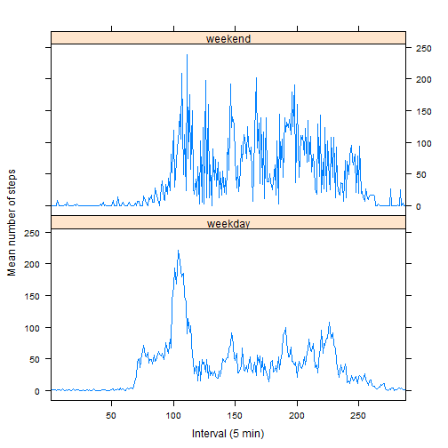

Assignment 1 Reproducible Research
========================================================

## 1. Loading the data


```r
setwd("E:/Research/Study/Coursera/Reproducible research/Assignment")
data <- read.csv("activity.csv")
```


## 2. Total and mean total number of steps taken per day?

```r
library(plyr)
sum.day = ddply(.data = data, .(date), summarise, sum.day <- sum(steps))

names(sum.day)[2] <- "sum.day"

barplot(sum.day$sum.day, names.arg = sum.day$date, las = 2, cex.names = 0.7, 
    ylab = "Total sum of steps per day")
```

 


Means and median

```r
mean.totalsteps <- mean(sum.day$sum.day, na.rm = TRUE)
median.totalsteps <- median(sum.day$sum.day, na.rm = TRUE)
```


The mean of total number of steps taken per day is 1.0766 &times; 10<sup>4</sup> 
The median of total number of steps taken per day is 10765

## 3. Average daily activity pattern

```r
mean.interval <- ddply(.data = data, .(as.factor(interval)), summarise, mean <- mean(steps, 
    na.rm = TRUE))

names(mean.interval) <- c("interval", "mean.interval")

plot(unique(data$interval), mean.interval$mean.interval, type = "l", ylab = "Mean number of steps", 
    xlab = "Interval (5 min)", las = 1)
```

 

```r

max.interval <- mean.interval$interval[which.max(mean.interval$mean.interval)]
```

The time interval with the maximum number of steps averaged across all days 
was 835 minutes.

## 4. Imputing missing values

Total number of NAs

```r
nas <- apply(data, 1, function(x) {
    any(is.na(x))
})
total.nas <- sum(nas)
```

The total number of NA in the data set is 2304


New data set with NAs filled with means of the five minute interval

```r
na.index <- which(is.na(data))
match.interval <- match(data$interval[na.index], mean.interval$interval)
data.noNas <- data
data.noNas$steps[na.index] <- mean.interval$mean.interval[match.interval]
```


Make a histogramm of the data set with the replaced NAs

```r
sum.day.noNas = ddply(.data = data.noNas, .(date), summarise, sum.day <- sum(steps))

names(sum.day.noNas)[2] <- "sum.day"

barplot(sum.day.noNas$sum.day, names.arg = sum.day.noNas$date, las = 2, cex.names = 0.7, 
    ylab = "Total sum of steps per day")
```

 


Means and median of the data set with the replaced NAs

```r
mean.totalsteps.noNas <- mean(sum.day.noNas$sum.day)
median.totalsteps.noNas <- median(sum.day.noNas$sum.day)
```


The mean of total number of steps taken per day is 1.0766 &times; 10<sup>4</sup> 
The median of total number of steps taken per day is 1.0766 &times; 10<sup>4</sup>

### What is the impact of imputing missing data on the estimates of the total daily number of steps?

There is no impact on the mean, however the median changes. This is after substituting missing values with the means of intervals the median changes to become identical to the mean. 


## 5. Differences in activity patterns between weekdays and weekends?


```r
data$date <- as.Date(data$date)
weekday.type <- weekdays(data$date)
weekend <- which(weekday.type %in% c("Saturday", "Sunday"))
weekday <- which(weekday.type != c("Saturday", "Sunday"))

data$day.type <- NA
data$day.type[weekend] <- "weekend"
data$day.type[weekday] <- "weekday"

table(data$day.type)
```

```
## 
## weekday weekend 
##   15264    2304
```


### Panel plot comparing weekdays and weekend days


```r
mean.day.type <- ddply(.data = data, .(as.factor(interval), day.type), summarise, 
    mean.day.type <- mean(steps, na.rm = TRUE))

names(mean.day.type) <- c("interval", "day.type", "mean.interval")

mean.day.type$day.type <- as.factor(mean.day.type$day.type)

library(lattice)
xyplot(mean.day.type$mean.interval ~ mean.day.type$interval | mean.day.type$day.type, 
    type = "l", scales = list(x = list(at = seq(0, 250, 50), labels = seq(0, 
        250, 50))), xlab = "Interval (5 min)", ylab = "Mean number of steps", 
    layout = c(1, 2))
```

 

